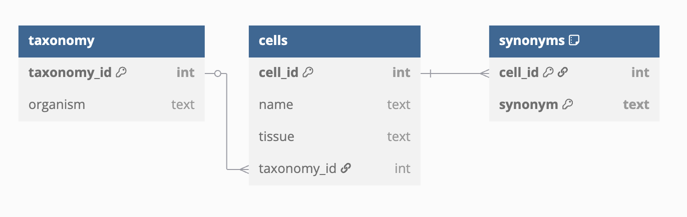
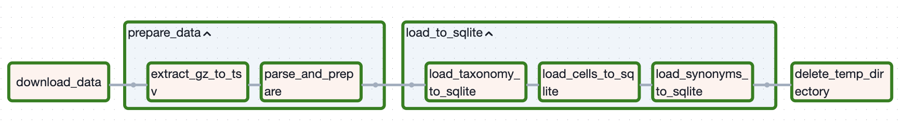

# Cell2Info Data Pipeline

[cell2info.gz](https://ftp.ncbi.nlm.nih.gov/pubchem/Target/cell2info.gz) 파일의 데이터를 로컬 SQLite DB로 적재하는 Airflow 기반 데이터 파이프라인 구현 과제

---

## 실행 방법
> 사전에 [Docker](https://www.docker.com/)와 [Docker Compose](https://docs.docker.com/compose/)가 설치되어 있어야 합니다.

1. **레포지토리 클론**
    ```bash
    git clone <repo-url>
    cd <repo-directory>
    ```

2. **환경 변수 설정**:
    민감한 정보는 포함되어 있지 않으며 `.env.example` 파일을 그대로 복사하여 사용하시면 됩니다.
    ```bash
    cp .env.example .env
    ```

3. **도커 컨테이너 빌드 및 실행**
    ```bash
    docker compose up --build
    ```

4. **서비스 접속**:
- **Airflow**: [http://localhost:8080](http://localhost:8080)  
    - ID / PW: airflow / airflow
    
    Airflow UI에 접속한 후:
    1.	메뉴에서 DAGs 탭으로 이동합니다.
    2.	등록된 cell2info DAG를 활성화 시키고, 우측의 ▶ (Trigger DAG) 버튼을 눌러 수동 실행합니다.
        - 이 파이프라인은 단일 실행으로 구성되어 있어, DAG 스케줄링은 수동 트리거 방식으로 사용됩니다.
    3.	DAG 실행 흐름 및 결과는 Graph View와 Log를 통해 확인할 수 있습니다.

---

## 저장소 구조
```
├── dags/                  # Airflow DAG 정의
│   └── cell2info/         # cell2info DAG 관련 폴더
│       ├── cell2info.py   # DAG 정의 파일
│       ├── tasks.py       # 각 태스크 함수 정의
│       └── utils.py       # 유틸 함수 정의
├── db/                    # 결과 db 저장 위치
├── data/                  # 임시데이터, 원본데이터 저장 위치
├── tests/                 # 유닛 테스트
├── requirements.txt       # 실행용 의존성
├── requirements-dev.txt   # 개발용 도구 (pytest 등)
├── Dockerfile             # 커스텀 Airflow 이미지
├── docker-compose.yml     # 실행 환경 구성
└── .env.example           # 환경변수 예시
```

---

## 구현 사항

### 1. 데이터 파이프라인
#### 1-1. 데이터베이스 스키마 설계


#### 1-2. 데이터베이스 파이프라인 구현
환경:
- Python 3.12
- Airflow 2.10.2 (apache/airflow:2.10.2-python3.12)

**DAG 구성도**

- `download_data`: cell2info.gz 파일을 URL에서 다운로드
- `prepare_data`
    - `extract_gz_to_tsv`: .gz 파일을 압축 해제하여 TSV 형태로 가공
    - `parse_and_prepare`: 데이터 파싱 후 테이블별로 임시 JSON 파일 생성
- `load_to_sqlite`: 데이터를 SQLite 각 테이블에 적재
    - 최종 결과는 다음 경로에 저장됩니다:`./db/cell2info.db`
- `delete_temp_directory`: 임시 데이터 정리

### 2. 비지니스 로직 검증용 테스트 코드 작성
- `parse_and_prepare` Task에서 사용하는 함수에 대한 단위 테스트 코드 작성
- 테스트는 `pytest`를 사용하여 구현하였으며, `tests/` 폴더에 위치
- 입력 TSV에 대한 정규화 결과가 의도대로 나오는지 검증
- 테스트 방법:
    ```bash
    pip install pytest
    pytest -v
    ```


### 3. GitHub Actions를 활용한 CI/CD
- .github/workflows/ci-cd.yml에 워크플로우 정의
- main에 push시 다음 작업 자동 수행:
    - pre-commit을 통한 린트 및 포맷 검사
    - pytest 기반 테스트 자동 실행
